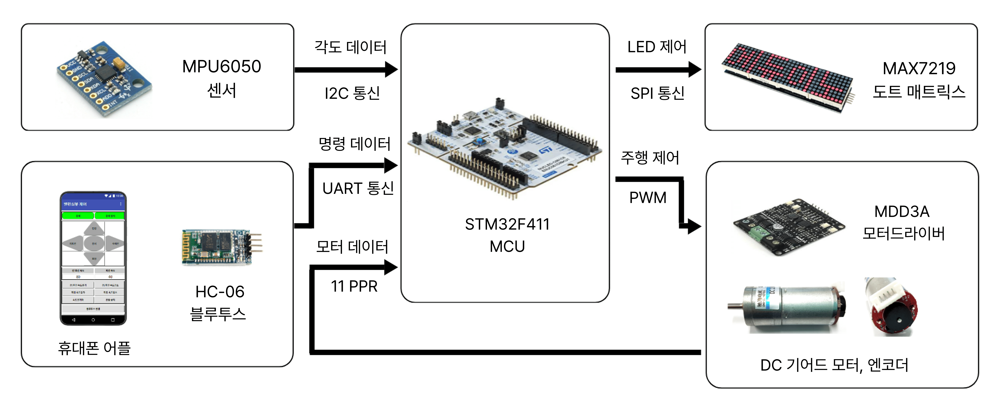
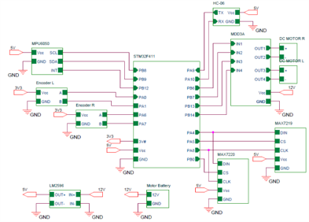

# 밸런싱봇
> STM32와 임베디드 제어를 활용해 개발한 자율 밸런싱 로봇
## 📌 프로젝트 개요
### 수행 기간
> 2026.04.03 ~ 2026.04.14
### 팀원
> 김광현, 명지훈, 위오현, 최민지
### 목표
> 실시간성 확보  
> 정밀 모터 제어  
> 자세 유지 안정  
### 주요 기능
> 로봇의 기울기 및 자세 측정  
> 실시간 밸런싱  
> 좌우 모터 속도 및 방향 제어  
> 표정 출력(SPI)  
> 블루투스 통신 기능(I2C)  

## ⚙️ 시스템 아키텍처

## 🛠️ 하드웨어

  
HW
 
  
|부품명|역할|
|------|------|
|STM32F411    |전체 시스템 제어|
|MPU6050      |기울기, 각속도 측정|
|MDD3A        |모터 속도, 방향 제어|
|LM2596       |전압 변환, 보드 전원 공급|
|HC-06        |블루투스 UART 통신|
|DC 기어드 모터|밸런싱 및 주행 출력|
|엔코더        |모터 회전 속도, 위치, 방향 측정|
|MAX7219      |상태 및 표정 표시

  
회로도
 
  

### 고려사항
#### 전/후 폭 최소화
> 로봇 전/후 폭이 넓어질수록 바퀴 축 기준 불필요한 관성 모멘트 증가, 제어 응답성 저하, 토크 낭비  
> -> 물리적 폭 10cm 이내 설계
#### 제어부 전원 독립 및 안정화
> 모터가 강하게 구동되거나 방향을 바꿀 때 순간적으로 많은 전류를 소모하여 전압 강하 발생 위험성
> -> 강압 컨버터를 장착하여 모터의 전압 변동과 무관하게 안정적인 전압을 공급
#### 무게 중심 및 기구적 안정성
> 무게 중심이 높고 무거울수록 로봇이 쓰러지는 속도가 느려짐
> -> 부품을 수직 방향으로 층층이 쌓아 올리는 구조 채택, 무거운 부품을 상단에 배치

## 💾 데이터
### 1️⃣ 수집
- Python을 사용한 방/책상 사진 웹 크롤링
- 사람, 워터마크 등 포함된 이미지 제거
### 2️⃣ 전처리
  - 이미지 표준화 : 해상도 256px * 256px, jpg 포맷
  - 데이터 증강 (회전, 반)
  - gray scale 적용
### 3️⃣ 라벨링
- clean
- dirty
  - 판단 기준 : 10.1017/S1041610209990135 참고

## 🎥 시연

## 🚨 트러블슈팅
### 1️⃣ 시스템 다운

### 2️⃣ 센서값 지연

### 3️⃣ 쏠림

### 4️⃣ 전/후진 브레이크

### 5️⃣ 센서 데이터 손상
6️⃣ 로봇 정지 시 밀림 현상

