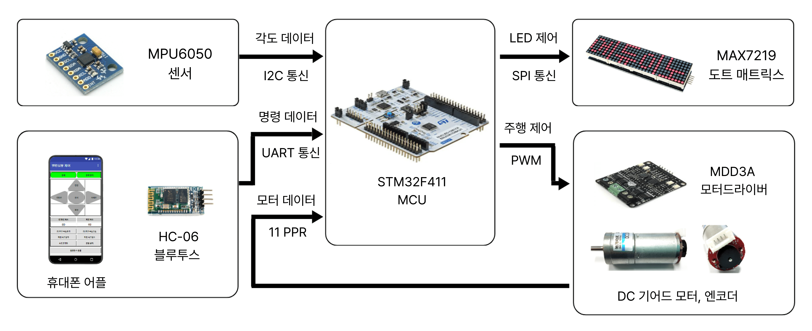
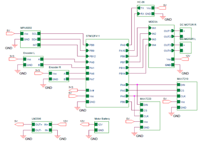

# 밸런싱봇
> STM32와 임베디드 제어를 활용해 개발한 자율 밸런싱 로봇
## 📌 프로젝트 개요
### 수행 기간
> 2026.04.03 ~ 2026.04.14
### 팀원
> |이름|역할|
> |------|------|
> |김광현 |PM, 전체적인 SW 구현
> |명지훈 |PWM 모터 제어, PID 튜닝|
> |위오현 |도트 매트릭스 제어, UART 통신 구현|
> |최민지 |하드웨어 제작, PID 튜닝|

### 목표
> - 실시간성 확보  
> - 정밀 모터 제어  
> - 자세 유지 안정  
### 주요 기능
> - 로봇의 기울기 및 자세 측정  
> - 실시간 밸런싱 및 좌우 모터 속도 및 방향 제어를 통해 안정적인 상태 유지
> - 로봇의 기울기 각도나 수행 중인 명령에 따른 표정 출력(SPI)을 통해 사용자와의 원활한 상호작용 가능
> - 블루투스 통신 기능(I2C)을 통해 스마트폰으로 로봇 무선 제어 가능
### 성과
> - 제자리 밸런싱 시 진동 폭 $\pm$ 2도 이내 제어  
> - 1.5cm 장애물 극복 주행  
> - 외부 충격 복원 능력 확보

## ⚙️ 시스템 아키텍처

## 🎥 시연
### 밸런싱
  
### 주행
  
### 장애물 극복
  

## 🛠️ 하드웨어

  
HW
 
  
|부품명|역할|
|------|------|
|STM32F411    |전체 시스템 제어|
|MPU6050      |기울기, 각속도 측정|
|MDD3A        |모터 속도, 방향 제어|
|LM2596       |전압 변환, 보드 전원 공급|
|HC-06        |블루투스 UART 통신|
|DC 기어드 모터|밸런싱 및 주행 출력|
|엔코더        |모터 회전 속도, 위치, 방향 측정|
|MAX7219      |상태 및 표정 표시

  
회로도
 
  

  
고려사항
 
  
#### 1️⃣전/후 폭 최소화
> 로봇 전/후 폭이 넓어질수록 바퀴 축 기준 불필요한 관성 모멘트 증가, 제어 응답성 저하, 토크 낭비  
> -> 물리적 폭 10cm 이내 설계
#### 2️⃣제어부 전원 독립 및 안정화
> 모터가 강하게 구동되거나 방향을 바꿀 때 순간적으로 많은 전류를 소모하여 전압 강하 발생 위험성  
> -> 강압 컨버터를 장착하여 모터의 전압 변동과 무관하게 안정적인 전압을 공급
#### 3️⃣무게 중심 및 기구적 안정성
> 무게 중심이 높고 무거울수록 로봇이 쓰러지는 속도가 느려짐  
> -> 부품을 수직 방향으로 층층이 쌓아 올리는 구조 채택, 무거운 부품을 상단에 배치

## 🛠️ 소프트웨어

  
SW
 
  
### IMU 센서 데이터 처리
#### 1️⃣고속 I2C 통신
> 400kHz로 통신 속도를 최적화하여, 센서 데이터를 읽어오는 지연 시간 최소화  
> DMP FIFO 버퍼 오버플로우 및 데이터 꼬임 방지  

#### 2️⃣인터럽트 기반의 Non-blocking 데이터 수신
> 센서가 데이터 준비 완료 신호를 보낼 때만 인터럽트 발생  
> 인터럽트 실행 시 메인 루프 동작  

#### 3️⃣RAW 값 기반의 상보필터가 아닌 DMP 기능 사용
> 3차원 공간의 회전을 쿼터니언 형태로 출력  
> 쿼터니언을 중력 벡터로 변환한 뒤 asin 함수를 통해 현재 기울기 추출  
> 로봇의 흔들림이 클 때 발생하는 계산 오류를 원천적으로 차단  
> DLPF(Digital Low Pass Filter, 20Hz) 기능 활용  
> 복잡한 6축 센서 융합 연산을 STM32가 아닌, DMP 하드웨어 가속기에 전담  

### 엔코더 센서 데이터 처리
#### 1️⃣모터의 실제 이동 속도 및 변위 측정
> 현재 속도와 목표 속도의 차이를 엔코더로 계산하여 로봇이 얼마나 기울어져야 하는지 MCU에 지시 
> 엔코더가 밀리지 속도를 감지해 오차를 누적, 로봇의 물리적 무게중심을 찾아내어 정지 상태 유지

#### 2️⃣로봇의 주행 기능
> 이중 루프 제어를 통한 주행 및 영점 보정 
> 블루투스 명령에 따른 목표 속도와 현재 속도의 오차를 계산, 내부 루프(IMU)에 목표 기울기 각도를 지시

### 모터 출력 제어
#### 1️⃣PWM 신소 기반의 정밀한 모터 제어
> STM32 MCU에서 출력하는 4개의 PWM 신호를 통해 모터의 방향, 속도 제어
> 모터의 최소 PWM 값에 IMU와 엔코더에 의해 정해진 출력을 더해 모터 출력

### 블루투스 통신 및 앱제어
#### 1️⃣UART 통신을 통한 로봇 제어
> 블루투스 모듈과 UART 통신을 통해 스마트폰과 로봇 간 무선 통신 구현
> MIT App Inventor를 이용해 제어 앱 제작

### 실시간 상태 시각화
#### 1️⃣SPI 통신을 이용한 실시간 상태 시각화
> SPI 통신을 통해 로봇의 밸런싱 상태를 표정으로 피드백하는 직관적 시스템 구현

## 🚨 트러블슈팅
### 1️⃣ 시스템 다운

#### 문제
> 동작 중 전원이 갑자기 꺼져버리는 현상 발생  
> 정제되지 않은 센서 RAW 데이터의 튐 현상으로 인해 모터에 급기동, 역회전 명령이 인가되어 과전류로 인한 시스템 다운  
#### 해결 방안
> MPU6050 내부의 DMP 기능을 도입, DMP의 하드웨어 필터링으로 안정적인 기울기 값을 도출하여 모터에 가해지는 충격 완화

### 2️⃣ 센서값 지연

#### 문제
> 가속도 센서값 출력 지연 문제  
> 누적된 값을 입력받아 로봇의 반응속도가 급격하게 느려지는 문제 발생  
#### 해결 방안
> DMP 가속 기능과 인터럽트 방식을 활용하여 제어 루프의 속도를 일정하게 유지  
> 센서의 통신 속도와 보드의 동작 속도를 일치시켜 센서값을 바로 받아옴

### 3️⃣ 쏠림

#### 문제
> 밸런싱을 하는 중 한쪽 방향으로 힘을 받으면 그 방향으로 계속 전진하는 문제 발생  
#### 해결 방안
> 엔코더 연결  
> 엔코더 데이터를 통해 로봇의 실제 주행 거리를 반영하여 현재 위치를 유지하고, 정지 정밀도를 높임

### 4️⃣ 센서 데이터 손상
#### 문제
> DC 모터 구동 시 고주파 노이즈 발생하여 MPU6050 센서 통신 오작동  
#### 해결 방안
> 모터 전원선과 센서 통신선을 최대한 멀리 이격해 간섭 최소화  
> 모터 양단에 세라믹 커패시터 장착하여 노이즈 필터링

### 5️⃣ FPU 전원 인가 시 HardFault
#### 문제
> 시스템 초기화 시 FPU 전원이 들어오기 전에 명령어가 먼저 실행됨  
> HardFault 발생  
#### 해결 방안
> 부동소수점 변수와 연산이 포함된 메인 루프를 완벽히 격리  
> FPU 활성화 후 함수 호출

